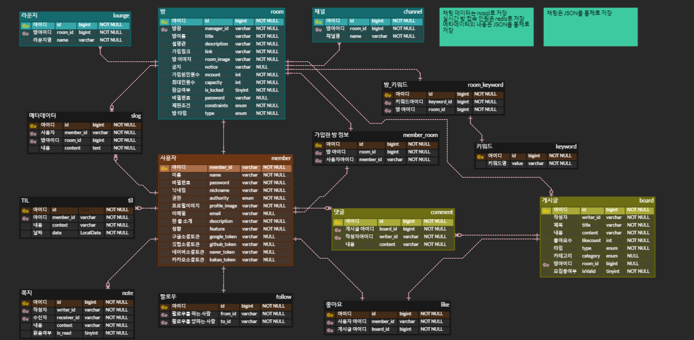
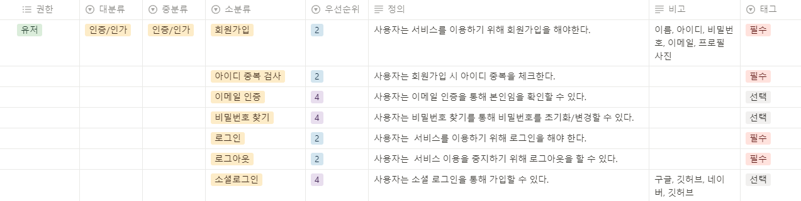

# 🌠 개발자들을 위한 모각코 커뮤니티 사이트 COMEET
{: width="600" height="350"}

<hr>

여기에 메인 이미지


## 📌 서비스 소개

##### 🤔 Why Comeet?
- 왜 스터디를 모집하는 공간과 스터디를 진행하는 공간이 분리되어야할까? 라는 불편함에서 시작하였습니다.
- 더 나아가 함께 지식을 공유하는 개발자들만의 문화를 적극 반영한 온라인 스터디 플랫폼을 구상하게 되었습니다.

##### 🧑‍🤝‍🧑 Easy & Fast Interaction
- 코밋에서는 누구나 들어올 수 있는 방을 일회성으로 생성하여 사람들과 함께 쉽고 빠르게 공부할 수 있습니다.
- 또한 모집 게시판에서 보다 지속적인 스터디를 위해 사적인 방을 만들어 운영할 수도 있습니다.

##### 🔄 Real-Time Study
- 화면 공유를 통해 다른 개발자들의 공부 방법을 쉽게 참고할 수 있습니다.
- 실시간 마크다운 코드 채팅을 통해 즉각적이며 상호적인 스터디를 진행할 수 있습니다.

##### 👨‍💻 For Developers
- 코밋은 관심있는 분야, 공부시간이 담긴 메타데이터를 통해 사용자의 기록, 분석한 정보를 제공합니다.
- 또한 공부 성향, TIL을 통해 자신의 스터디 스타일을 표현하고 자신과 잘 맞는 개발자를 찾아 교류할 수 있습니다.

<br/>

## 👩 팀 구성

| [김태수](https://github.com/benyy0101)                                                                                                                                     | [이유로](https://github.com/rheeeuro)                                                                                                                                     | [정현아](https://github.com/JHyeon-a)                                                                                          | [김희연](https://github.com/heeyeon3050)                                                                                                                                     | [정덕주](https://github.com/Damongsanga)                                                                                                   | [김동건](https://github.com/Zerotay)                                                      |
| ------------------------------------------------------------------------------------------------------------------------------------------ | ------------------------------------------------------------------------------------------------------------------------------------------ | ------------------------------------------------------------------------------------------------------------------------------ | ------------------------------------------------------------------------------------------------------------------------------------------ | ------------------------------------------------------------------------------------------------------------------------------------------ | ----------------------------------------------------------------------------------------- |
|  |  |  |  |  |  |
| Leader, Front                                                                                                                              | Front, Back                                                                                                                                | Front                                                                                                                          | Back                                                                                                                                       | Back                                                                                                                                       | CI&CD, Front                                                                              |
| 담당 기능                                                                                                                                  | 담당 기능                                                                                                                                  | 담당 기능                                                                                                                      | 담당 기능                                                                                                                                  | 유저 인가.인증                                                                                                                             | 담당 기능                                                                                 |

<br/>

## 🛠️ 기술 스택

**Front**
<br/>


**Back**
<br/>
 
 
 


**Database**
<br/>


**Environment**
<br/>


**Cooperation**
<br/>


<br/>

## 🌐 포팅 메뉴얼

<details>
<summary>포팅 메뉴얼 펼치기</summary>
<div markdown="1">

##### 1. 개발 환경 (Version)

- Front
  - VS Code

- Back
  - Java : `coretto-17`
  - SpringBoot : `3.2.1, Gradle, Jar`
  - IntelliJ : `2021.2.4 IU-212.5712.43 December 21, 2021`
  - MySQL : `8.2`
  - MySQL workbench : `8.0.21`

##### 2. 주요 setting

- React
      
    ```
    REACT_APP_API_SERVER_URL = https://i10a506.p.ssafy.io/api
    REACT_APP_WEBSOCKET_SERVER_URL = https://i10a506.p.ssafy.io:8443/
    REACT_APP_SECRETKEY = {YOUR SECRET KEY}
    ```

- Spring Boot

  - application-secret.yml 파일을 만들어 .gitignore 에 관리하여 사용하였습니다.
  - application.yml

    ```
    spring:
    profiles:
        include: secret

    datasource:
        url: jdbc:mysql://127.0.0.1:3306/comeet?serverTimezone=UTC
        username: {username}
        password: {password}
        driver-class-name: com.mysql.cj.jdbc.Driver

    jpa:
        hibernate:
        ddl-auto: update
        properties:
        hibernate:
            format_sql: true
            dialect: org.hibernate.dialect.MySQL8Dialect
            default_batch_fetch_size:

    jwt:
        header: Authorization
        secret: {your secret SSL Encryption, create by `openssl rand -base64 60`}
        access-token-validity-in-seconds : 7200
        refresh-token-validity-in-seconds : 86400

    data:
        redis:
        host: localhost
        port: 6379
        mongodb:
        uri: {yourMongoDBURI}

    security:
        oauth2:
        client:
            registration:
            github:
                client-id: {your github client Id}
                client-secret: {your github client secret}
            password-salt: {your password-salt. create your own random value}

    servlet:
        multipart:
            max-file-size: -1
            max-request-size: -1

    logging.level:
    org.hibernate.SQL: debug

    aes:
    secret-key: {your aes128 encryption secret key. create your own random value}

    cloud:
    aws:
        s3:
        bucket: {your bucket}
        credentials:
        access-key: {your access-key}
        secret-key: {your secret-key}
        region:
        static: ap-northeast-2 # 한국 서버
        auto: false
        stack:
        auto: false

    ```

##### 3. 빌드 및 실행

- Front
  ```
  npm install -f && CI=false npm run build
  cp -rf  build /var/jenkins_home/settings
  ```
  ```
  serve -s /settings/build
  ```
- Back

  ```
  gradlew clean bootJar
  ```

  ```
  java -jar comeet-0.0.1-SNAPSHOT.jar
  ```

##### 4. 배포

- Nginx

  ```
  upstream ssafy {
      server {your web application server for dev};
  }
  upstream ssaf {
      server {your web application server for deploy};
  }

  server {
      server_name localhost;
      listen 80;
      listen [::]:80;

      location / {
          proxy_pass {your web server};
      }
  }
  server {
      listen 80 default_server;
      listen [::]:80 default_server;

      root /var/www/html;
      # Add index.php to the list if you are using PHP
      index index.html index.htm index.nginx-debiain.html;
      location / {
          try_files $uri $uri/ =404;
      }
  }


  server {
  #    index index.html index.htm index.nginx-debian.html;
      server_name {your domain name}; # managed by Certbot


      location / {
          proxy_pass {your web server};
      }
          location /api {


          rewrite ^/api/(.*)$ /$1 break;
          proxy_pass http://ssafy;
          proxy_pass_request_headers on;
      }
      location /api2 {
          rewrite ^/api2/(.*)$ /$1 break;
          proxy_pass http://ssaf;
          proxy_pass_request_headers on;
      }

      listen [::]:443 ssl ipv6only=on; # managed by Certbot
      listen 443 ssl; # managed by Certbot
      ssl_certificate {your full chain pem}; # managed by Certbot
      ssl_certificate_key {your private key pem}; # managed by Certbot
      include /etc/letsencrypt/options-ssl-nginx.conf; # managed by Certbot
      ssl_dhparam /etc/letsencrypt/ssl-dhparams.pem; # managed by Certbot

  }
  server {
      if ($host = {your domain name}) {
          return 308 https://$host$request_uri;
      }  # managed by Certbot
      if ($host = localhost) {
          return 301 http://$host:3002$request_uri;
      }


      listen 80 ;
      listen [::]:80 ;
      server_name {your domain name}
      return 404; # managed by Certbot


  }
  ```

</div>
</details>

<br/>

## 🎨 아키텍처


## 💡 주요 기능

(화면녹화해서 gif로 변환해서 넣을 예정)

1. 로그인 & 소셜 로그인
2. 일회용방, 지속방 구분
3. 채팅 & 코드채팅
4. 공유 코드 채팅 (중요)
5. 캠공유 & 화면공유 & 필터 (중요)
6. 방 & 게시판 검색
7. 모집 게시판 & 가입링크 & 쪽지 전송 (중요)

<br/>

## 📄 문서

##### 1. ERD


##### [2. 요구 사항 명세서](https://satin-turkey-70b.notion.site/d8936d52d8b34c3fa1ae3326b29426b8?pvs=4)



##### [3. API 명세서](https://satin-turkey-70b.notion.site/API-75586b08754643c3b8c514174477d506?pvs=4)


##### [4. 스터디](https://satin-turkey-70b.notion.site/16e7dd0673a44db6b94d53347d6714f5?pvs=4)

<br/>

## ⏰ 개발 기간
- 24.01.08 ~ 24.02.15 (6주)
