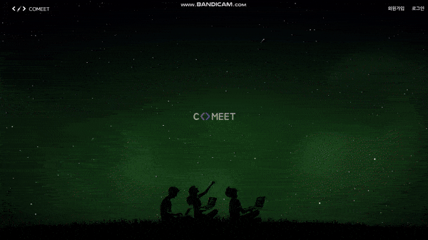
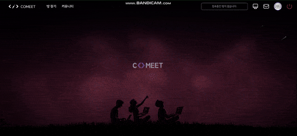
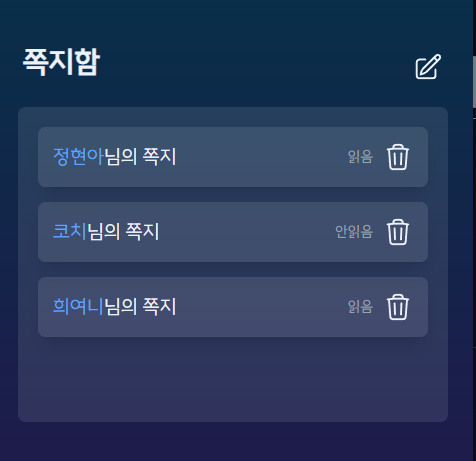
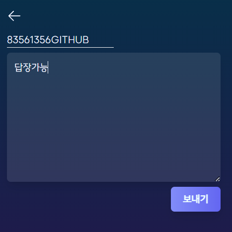
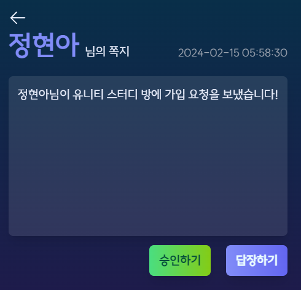

# 🌠 시연 시나리오

### Use Case Diagram

### 1. 로그인 & 소셜 로그인

- 서비스 자체 회원가입 or 깃헙 소셜 로그인 기능

### 2. 방 생성 및 검색

- 일회용 방, 지속성 방 설정하여 생성
- 일회용 방은 누구나 들어와서 공부할 수 있으며 지속방은 가입된 인원만 입장 가능

- 지속 방인 경우 방장의 가입 승인이 필요
- 스터디원을 모집하기 위한 모집 게시판을 통해 가입 요청 가능

- 방 및 게시판 필터링 검색 & 정렬 조건 지정

### 3. 방 가입 요청 및 승인

- 다른 유저들이 모집 게시판에서 원하는 방의 모집게시판에서 가입 신청
- 가입 신청시 방장에게 쪽지 자동 발신

- 방장이 받은 가입 요청 쪽지를 통해 승인하여 방에 가입시킬 수 있음

### 4. 채팅 & 공유채팅

- **라운지**
  - 방 내의 라운지에서 일반 채팅을 진행 가능
  - 라운지를 다양한 주제에 대해 이야기를 나눌 수 있음
- **채널**
  - 역시 여러 채널을 만들어 주제별로 화면 공유를 진행할 수 있음
- **채널 내 공유 편집기능**
  - 여러 사용자가 동시에 편집
  - 언어를 지정하여 가독성을 높힐 수 있음
  - 편집 내용을 불러내어 채팅에 마크다운 형태로 입력 가능

### 5. 채널 내 캠 & 화면공유

- 캠 & 화면 공유 가능
- 다양한 필터 적용

### 6. 마이페이지

- 사용자의 선호하는 공부 성향 지정
- 방 이용 메타데이터를 분석하여 제공
  - 관심있는 키워드
  - 주요 공부 시간대
  - 오늘, 최근 일주일, 최근 한달간 공부 시간
- TIL 작성 및 조회 기능
- 팔로잉 팔로우 기능

### 7. 쪽지
- 쪽지 조회
    
- 쪽지 답장  
  
- 쪽지 상세  
  
- 삭제와 가입승인 버튼을 눌러 각각의 기능을 수행할 수 있음
